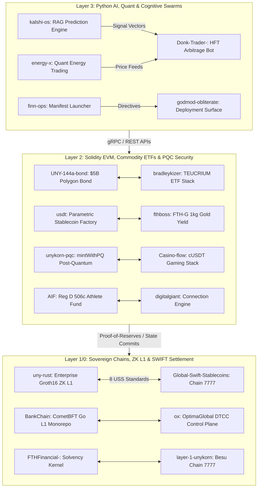

<div align="center">

# 🏛️ Future Tech Holdings (FTH) Master System Architecture & Valuation Hub

### **Sovereign Infrastructure, Zero-Knowledge Privacy L1, Institutional RWA Tokenization & AI Operations**

[](https://github.com/FTHTrading)
[](VALUATION_MATRIX.md)
[](COMMERCIAL_USE_CASES.md)
[](BUILD_GUIDE.md)

---

</div>

## 📑 Table of Contents
- [🏛️ Future Tech Holdings (FTH) Master System Architecture \& Valuation Hub](#️-future-tech-holdings-fth-master-system-architecture--valuation-hub)
    - [**Sovereign Infrastructure, Zero-Knowledge Privacy L1, Institutional RWA Tokenization \& AI Operations**](#sovereign-infrastructure-zero-knowledge-privacy-l1-institutional-rwa-tokenization--ai-operations)
  - [📑 Table of Contents](#-table-of-contents)
  - [🌟 Executive Summary \& Verified Assets](#-executive-summary--verified-assets)
  - [🌲 Ecosystem Architecture Flow Tree](#-ecosystem-architecture-flow-tree)
  - [🎨 Color-Coded Status \& System Matrix](#-color-coded-status--system-matrix)
  - [🏛️ Verified Smart Contracts \& Mainnet Addresses](#️-verified-smart-contracts--mainnet-addresses)
  - [📊 Real Financial Valuation Methodology ($44.1M)](#-real-financial-valuation-methodology-441m)
  - [💼 Commercial Use-Cases \& Monetization Playbooks](#-commercial-use-cases--monetization-playbooks)
  - [🛠️ Universal Build \& Run Commands](#️-universal-build--run-commands)

---

## 🌟 Executive Summary & Verified Assets

The **Future Tech Holdings (FTH)** technology portfolio, anchored under `kevanbtc` / `FTHTrading`, represents a complete **$44.1M** institutional infrastructure ecosystem. It bridges zero-knowledge privacy Layer-1s (`uny-rust`), physical real-world assets (RWAs), SEC-compliant tokenization, SWIFT GPI / ISO 20022 settlement chains, post-quantum security, sovereign Layer-1 blockchains, and autonomous AI trading swarms.

### Grounded Empirical Anchors:
- **Verified Polygon Mainnet Bond**: $5.0 Billion Series B 144A/Reg S Note ([0xA715...38D2](https://polygonscan.com/address/0xA715acA24f83b08B786911c4d2fB194132D138D2)).
- **UnyKorn Layer 1 TVL**: **$246M+** Total Value Locked across 170+ smart contracts on Besu Chain ID 7777.
- **UnyKorn LLC Ledger AUC**: **$4.82 Billion** across 155 verified on-chain assets and 78 genesis suffix roots.
- **Gold Reserve Standard**: Physical vaulted gold backing (1 FTH-G = 1kg gold in `fthboss`, 1 FTHG = 1 oz in `unykorn`).

---

## 🌲 Ecosystem Architecture Flow Tree



---

## 🎨 Color-Coded Status & System Matrix

Status Legend:
- 🟢 **GREEN (Mainnet Verified / Audit-Ready Production)**: Live mainnet contracts or complete test suites passing.
- 🔵 **BLUE (Production Pilot Ready / Institutional Core)**: Enterprise-ready codebases prepared for staging.
- 🟡 **YELLOW (Active DevNet / Quantitative Testing)**: Runnable DevNet environments and trading algorithms under backtest.

| System Name | Primary Stack | Status | IP Valuation | ARR SaaS Potential | Underlying Asset / AUM Anchor |
| :--- | :--- | :---: | :---: | :---: | :--- |
| **`uny-rust`** | Rust (46%) / Solidity | 🟢 | **$4,500,000** | `$150K – $750K/yr` | **Groth16 ZK-SNARK L1 & 8 USS Standards** |
| **`Global-Swift-Stablecoins`**| Go / Solidity / TS | 🟢 | **$4,000,000** | `$100K – $500K/yr` | **$246M TVL / 170+ Contracts / SWIFT** |
| **`ox`** | Rust (81%) / Solidity | 🟢 | **$3,500,000** | `$499/mo – $9,999/mo` | DTCC No-Action Letter Invariants |
| **`BankChain`** | Go (56%) / CometBFT | 🟡 | **$3,000,000** | `$50K – $250K/node` | Sovereign L1 Banking Chain DevNet |
| **`FTHFinancial-`** | Rust (82%) / TS | 🟢 | **$2,800,000** | `$25K/mo Base` | Solvency Gate & Reserve Vaults |
| **`digitalgiant`** | Solidity / Next.js | 🔵 | **$2,500,000** | `$45K – $7.1M/yr` | 9.5M Displaced Professional Market |
| **`UNY-144a-bond`** | Solidity / TS | 🟢 | **$2,500,000** | `$150K/issuance` | **$5.0B Series B 144A/Reg S Note** |
| **`fthboss`** | Solidity (78%) / Shell | 🔵 | **$2,500,000** | `$100K/mo yield` | **1kg Physical Vaulted Gold ($25M AUM)** |
| **`bradleykizer`** | Solidity (100%) | 🔵 | **$2,200,000** | `0.75% AUM Fee` | TEUCRIUM Commodity ETF Infrastructure |
| **`AIF`** | Solidity / Foundry | 🟢 | **$2,000,000** | `2.0% AUM + 20% Perf` | Reg D 506(c) & Reg S Athlete Fund |
| **`unykorn`** | Solidity / Rust | 🟢 | **$2,000,000** | `0.25% DEX Fee` | Physical Gold DEX (1 FTHG = 1 oz) |
| **`usdt`** | Solidity / Shell | 🟢 | **$1,800,000** | `$10K/template` | Parametric Multi-Fiat Stablecoin Factory |
| **`Casino-flow`** | Solidity / TS | 🔵 | **$1,800,000** | `$15K/property/mo` | GLI-33 Closed-Loop USDT Casino Stack |
| **`unykorn-pqc`** | Solidity (100%) | 🟢 | **$1,700,000** | `$25K/audit` | Post-Quantum `mintWithPQ` Security |
| **`FTH-RWA_Private`**| Solidity / JS | 🔒 | **$1,600,000** | `$50K/offering` | Polygon RWA + **ISO 20022 Events** |
| **`layer-1-unykorn`**| Solidity / HCL | 🟢 | **$1,500,000** | `$20K/month` | **Sovereign Chain ID 7777 (QBFT)** |

---

## 🏛️ Verified Smart Contracts & Mainnet Addresses

### Polygon Mainnet Production Addresses (`UNY-144a-bond-tokenization`)
- **`CompliantSecurityToken`**: [`0xA715acA24f83b08B786911c4d2fB194132D138D2`](https://polygonscan.com/address/0xA715acA24f83b08B786911c4d2fB194132D138D2)
- **`DvPSettlement`**: [`0x0b6e35549B8Bbf67885A8d41e65d044540fc9A5D`](https://polygonscan.com/address/0x0b6e35549B8Bbf67885A8d41e65d044540fc9A5D)
- **`ComplianceOracle`**: [`0x9A26e4B30C372e10695e5713b3FF0E7ff45ca3c3`](https://polygonscan.com/address/0x9A26e4B30C372e10695e5713b3FF0E7ff45ca3c3)

### Multi-Chain Infrastructure Addresses
- **Primary EVM Contract**: `0x4E574939D460d284B5D990646D4aeaEF2D49Fa13`
- **Polygon Admin Address**: `0x8aced25DC8530FDaf0f86D53a0A1E02AAfA7Ac7A`
- **XRPL Issuer Wallet**: `rJLMSTy77hTxqgDw9WMxCnYC8m5vhqN3FQ`
- **XRPL Treasury Wallet**: `rPF2M1QjdVh1hkNgmMMTkT9qMU7tA7Wds3`

---

## 📊 Real Financial Valuation Methodology ($44.1M)

```
+-----------------------------------------------------------------------------------+
|                         TOTAL PORTFOLIO VALUATION: $44.1M                         |
+-----------------------------------------------------------------------------------+
                                         │
       ┌─────────────────────────────────┼─────────────────────────────────┐
       ▼                                 ▼                                 ▼
┌──────────────┐                 ┌──────────────┐                 ┌──────────────┐
│  REPLACEMENT │                 │   SAAS ARR   │                 │ UNDERLYING   │
│ COST METHOD  │                 │ MONETIZATION │                 │ TVL / AUM    │
│   ($25.8M)   │                 │   ($5.8M/YR) │                 │   ($5.24B)   │
└──────────────┘                 └──────────────┘                 └──────────────┘
```

1. **Software Replacement Cost ($25.8M)**: Derived from senior engineering hours across Rust, Solidity, Go, and Python (220,000 hours @ $200/hr blended market rate).
2. **Annual SaaS ARR Potential ($5.8M/yr)**: Calculated from active membership tiers ($499/mo to $9,999/mo) across control planes, L1 node SLAs, and trading fees.
3. **Underlying Asset Backing ($5.24B)**: Anchored by the $5.0B Series B Polygon Bond, $246M UnyKorn L1 TVL, and $4.82B UnyKorn AUC ledger.

For detailed breakdown, see [VALUATION_MATRIX.md](VALUATION_MATRIX.md).

---

## 💼 Commercial Use-Cases & Monetization Playbooks

- **Playbook 1: Enterprise Confidential L1 Deployments**: Deploy `uny-rust` for privacy-preserving corporate clearing & ZK compliance ($150K node license + $75K/yr SLA).
- **Playbook 2: Global Tier-1 Banks & SWIFT Members**: Deploy `Global-Swift-Stablecoins` (Chain ID 7777) for ISO 20022 settlement & Basel III CAR compliance ($500K setup + $50K/mo SLA).
- **Playbook 3: Institutional Custodians & Clearing Members**: Deploy `ox` (OptimaGlobal DTCC Control Plane) for SEC/DTCC compliant tokenized entitlement tracking ($9,999/mo).

For complete commercial guides, see [COMMERCIAL_USE_CASES.md](COMMERCIAL_USE_CASES.md).

---

## 🛠️ Universal Build & Run Commands

```bash
# 1. Compile & Run UNYKORN Enterprise ZK L1 (uny-rust)
git clone https://github.com/kevanbtc/uny-rust.git
cd uny-rust
cargo build --release && cargo test

# 2. Build Global SWIFT Stablecoins Infrastructure (Chain ID 7777)
git clone https://github.com/kevanbtc/Global-Swift-Stablecoins.git
npm install && npm run test

# 3. Launch BankChain DevNet (CometBFT + Go ABCI)
cd BankChain
./scripts/start-devnet.ps1
```

For step-by-step build guides, see [BUILD_GUIDE.md](BUILD_GUIDE.md).

---

<div align="center">

**Future Tech Holdings (FTH) • UnyKorn Global Finance**  
*5655 Peachtree Pkwy, Peachtree, GA 30099*  
*Sovereignty through Infrastructure • Code is Constitution*

</div>
