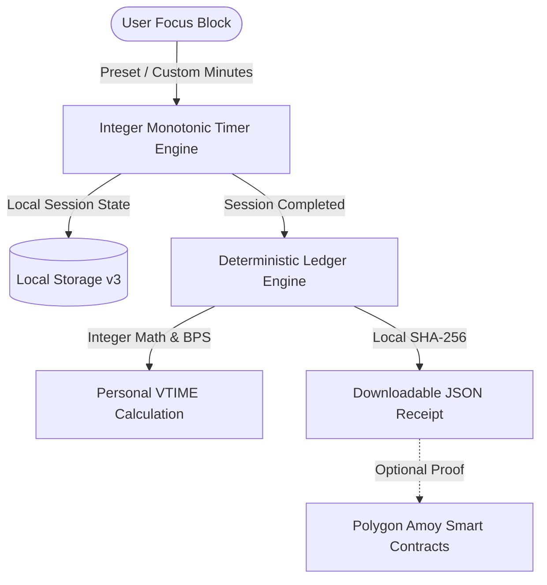

# ALL COUCH NO CAGE — Protocol & Architecture Overview
**System**: Deterministic Biophysical Time Protocol & Focus Architecture  
**Version**: `v3.0.0-truth-aligned`

---

## 1. Executive Summary

ALL COUCH NO CAGE is a client-first focus architecture that turns uninterrupted work sessions into verifiable progress. The architecture combines:
1. **Monotonic Focus Timers**: Client-side integer-second countdowns with deterministic recovery across page reloads.
2. **Deterministic Rust Math**: Basis-point (BPS) integer modeling for session impact and biophysical bounds with zero floating-point drift.
3. **Internal Ledger Units ($VTIME)**: Closed-loop non-monetary accounting credits with daily caps.
4. **Verifiable Receipts**: Local SHA-256 evidence seals with optional smart contract anchoring on Polygon Amoy.

---

## 2. Multi-Tier Architecture



---

## 3. Mathematical Formula Specification

```
Focus Units = min(Base_Hours × Rate × Severity × Evidence, Event_Cap, Daily_Cap)
```

- **`Base_Hours`**: Integer duration in hours (`minutes / 60`), bounded between `0.10h` (6 mins) and `24.00h` (1,440 mins).
- **`Rate`**: Baseline credit coefficient (`15.00 VTIME / hour`).
- **`Severity`**: Complexity tier multiplier in BPS (`10,000` = 1.0×, `14,000` = 1.4×, `18,000` = 1.8×).
- **`Evidence`**: Integrity tier in BPS (`8,000` = 80%, `9,000` = 90%, `10,000` = 100%).
- **`Event_Cap`**: Maximum units allowed per single session (`100.00 VTIME`).
- **`Daily_Cap`**: Maximum total units allowed per rolling 24-hour day (`300.00 VTIME`).

---

## 4. Non-Medical Policy

All physiological parameters (cardiac intervals, EEG bands, metabolic wattage) represent reference specifications in Rust and do not constitute medical monitoring or clinical software.
